# Image Processing: Lane Detection and Vehicle Tracking
2023–2024 - TEIXEIRA Pierre | LE LAY Louis

## TABLE OF CONTENTS

1. [INTRODUCTION](#introduction)
2. [PART 1 - Lane Detection](#part-1---lane-detection)
   - [a. Detection of the First Frame](#a-detection-of-the-first-frame)
   - [b. Conversion to HSV Color Space](#b-conversion-to-hsv-color-space)
   - [c. Explanation of Grayscale Conversion](#c-explanation-of-grayscale-conversion)
   - [d. Color Filtering and Edge Detection using the Canny Algorithm](#d-color-filtering-and-edge-detection-using-the-canny-algorithm)
   - [e. Creating Lines on the Borders](#e-creating-lines-on-the-borders)
3. [PART 2 - Vehicle Tracking](#part-2---vehicle-tracking)
   - [a. Motion Detection](#a-motion-detection)
   - [b. Conversion to Grayscale and Application of Gaussian Blur](#b-conversion-to-grayscale-and-application-of-gaussian-blur)
   - [c. Morphological Operations and Contour Creation](#c-morphological-operations-and-contour-creation)
   - [d. Creating Bounding Boxes](#d-creating-bounding-boxes)
4. [PART 3 - Vehicle Counting](#part-3---vehicle-counting)
   - [a. Creation of 4 Regions of Interest](#a-creation-of-4-regions-of-interest)
   - [b. Image Rotation and Extraction of Rotated Regions](#b-image-rotation-and-extraction-of-rotated-regions)
   - [c. Analysis of the Rotated Region](#c-analysis-of-the-rotated-region)

## INTRODUCTION

As part of our training in computer science, and specifically in the field of image analysis, we applied the skills acquired in C++ programming, using OpenCV, to process and analyze a video sequence of road traffic. This report details our approach and achievements during TP2. The work was divided into three main parts, each aiming to explore different aspects and challenges of video analysis in real-world conditions.

## PART 1 - Lane Detection

Complete the provided code to automatically detect the two fast lanes. Justify your choices and comment on the results obtained. Draw the borders in the video.

This section presents our approach to automatically detect the two fast lanes from the provided videos. We completed the initial code using various image processing techniques to isolate and mark the lanes. The chosen methods and our selection logic are justified, and we discuss the effectiveness of our approach through the analysis of the results obtained, including how we drew the lane borders in the video.

### a. Detection of the First Frame

The first thing we did was to select a moment without vehicles in our video. When we look at the video, we notice that after a short period when the video is black, the first frames that follow are free of vehicles. Therefore, in the loop, we created a condition to process each frame until it is a colored frame and then continue processing that frame until the end.

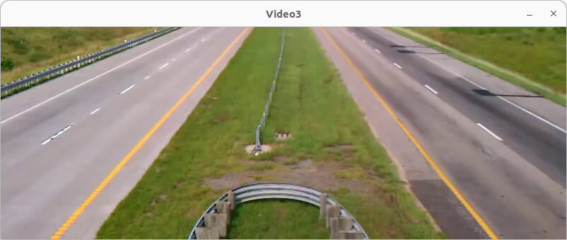

### b. Conversion to HSV Color Space

For processing, after a few idea trials, we opted for a conversion to HSV color space. This conversion is common in image processing as it allows separating hue from brightness, making color processing more intuitive and less sensitive to lighting variations.

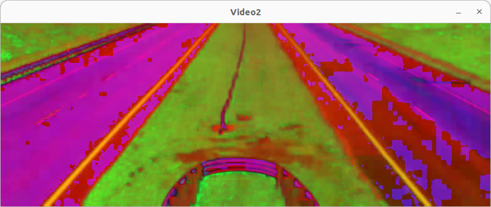

### c. Explanation of Grayscale Conversion

This choice is wise for robustness against variable lighting and ease of color segmentation. We first opted for a method using grayscale conversion, but the created lines were too approximate, so we decided to switch to HSV. Indeed, we were not satisfied with seeing that on one side the lines delimiting the lane were between the grass and the road, but on the other, they were based on the road markings.

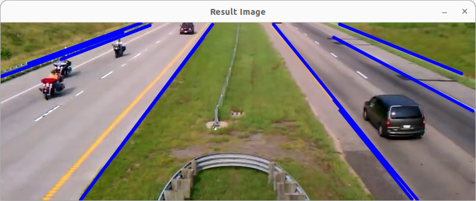

### d. Color Filtering and Edge Detection using the Canny Algorithm

With HSV, the idea was to use the green of the grass around the road. We use color filtering with `cv::inRange` with predefined HSV thresholds. The code filters out colors that do not match the specified range (aiming to detect a specific color range). To determine the most interesting thresholds, we created an intermediate program to see the threshold settings with a slider. This allowed us to quickly find the necessary thresholds without a long sequence of make and ./Tp. Once those were found, we then detect edges in the filtered image using the Canny algorithm. These edges will help us identify contours and shapes, in our case, lane lines.

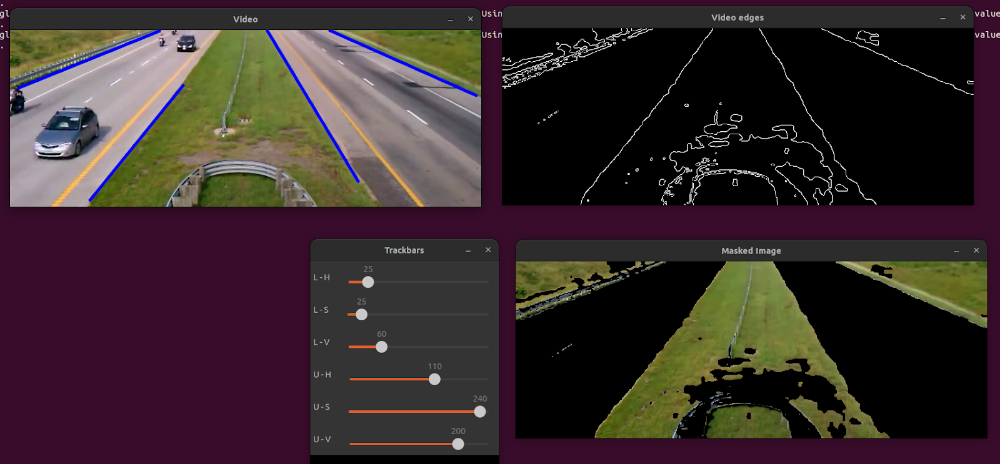
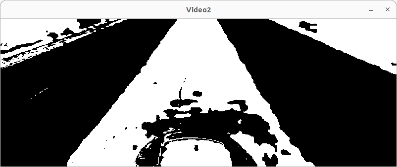
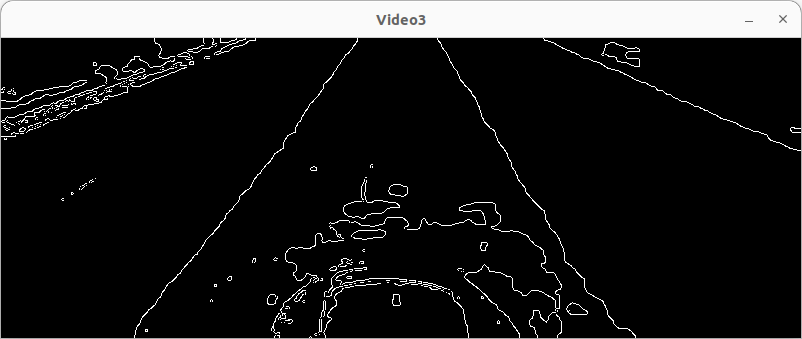

### e. Creating Lines on the Borders

After detecting the edges, we apply the Hough transformation for lines to identify line segments in the image. This allows detecting lane lines even when they are discontinuous or partially visible. Then, using the function we created, `drawInfiniteLine`, which extends and draws the detected lines across the width of the image, which was very practical for lanes. As can be seen, this time the lines are well placed on both sides.

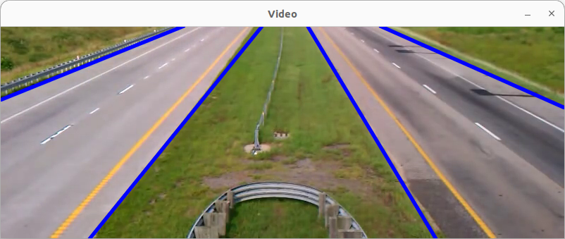

## PART 2 - Vehicle Tracking

Using the techniques provided in the course, track the vehicles throughout the video. Justify your choices and comment on the results obtained. Draw a square around the detected vehicles.

Here, we explain how we applied the vehicle tracking techniques presented during the course to identify and track vehicle movements through different video sequences. We justify our algorithm and parameter choices, while analyzing the challenges encountered during this phase. The results, illustrated by drawing squares around detected vehicles, are commented on in detail.

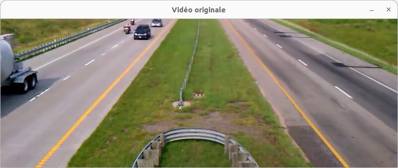

### a. Motion Detection

This time, we convert the image from BGR color space to grayscale. To detect motion, we reuse the image saved in part 1. Indeed, having an image without vehicles will allow us to highlight the changes between the current image and the image without vehicles. We then perform a subtraction of the two images followed by binarization, which allows us to keep only the moving objects. This method is commonly used to highlight morphological operations, but it could be problematic if there are trees moving with the wind in the background.

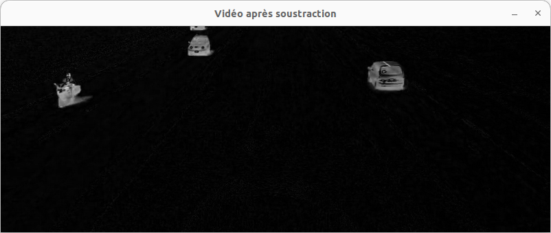

### b. Conversion to Grayscale and Application of Gaussian Blur

We then apply a Gaussian blur to reduce noise and details in the image, which improves the performance of the subsequent detection steps.

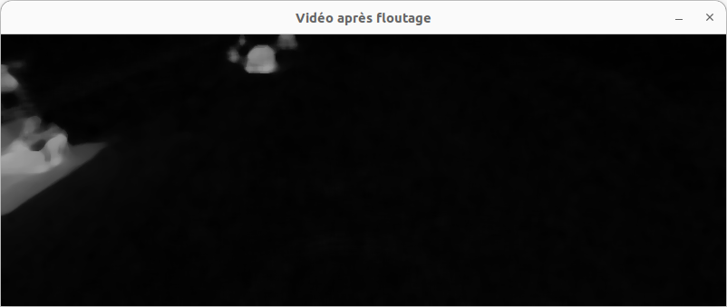

### c. Morphological Operations and Contour Creation

We then perform morphological operations (erosion and dilation) to highlight the moving objects. We detect the contours using `findContours` for the detected moving objects. This allows us to identify individual elements in the image, which in our case will be vehicles. However, if there are non-vehicular moving objects (pedestrians, trees, etc.), they will also be identified as vehicles. The shape analysis should therefore be made more sophisticated.

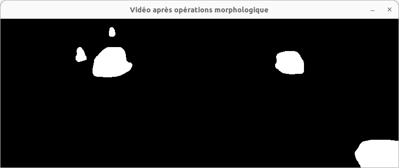
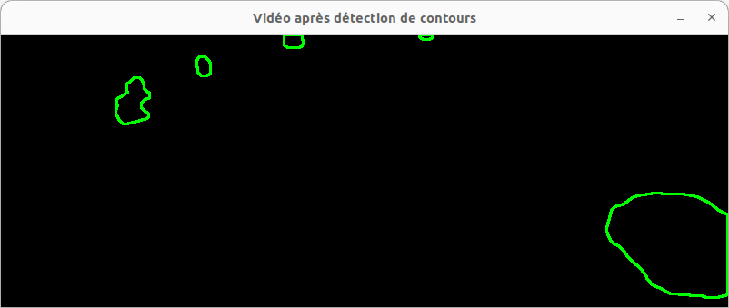

### d. Creating Bounding Boxes

Finally, for each detected contour that passes a certain area threshold, a bounding box is drawn around it. This visually represents the detected vehicle. This has the advantage of easily highlighting moving vehicles. However, it may lack precision. For instance, if two vehicles are too close together, they may be treated as a single surface, resulting in a single bounding box around both vehicles even though they are different vehicles.

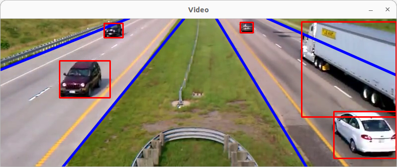
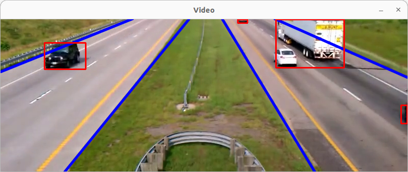

## PART 3 - Vehicle Counting

After detecting them, count the number of vehicles passing in each direction. What problems were encountered? Comment on the solutions found.

Finally, this part focuses on quantifying the vehicle flow by counting the number of vehicles passing in each direction. We describe the problems encountered, particularly in terms of detection and tracking, and explain the solutions implemented to address them. The impact of these solutions on the counting accuracy is also discussed.

### a. Creation of 4 Regions of Interest

We call the `zone` function four times, which is a function we coded. It starts by creating a region of interest, which corresponds to an inclined rectangle placed on the road to detect vehicles in the most optimal way. Care was needed in placing them to ensure all vehicles were detected, especially when two motorcycles are close together.

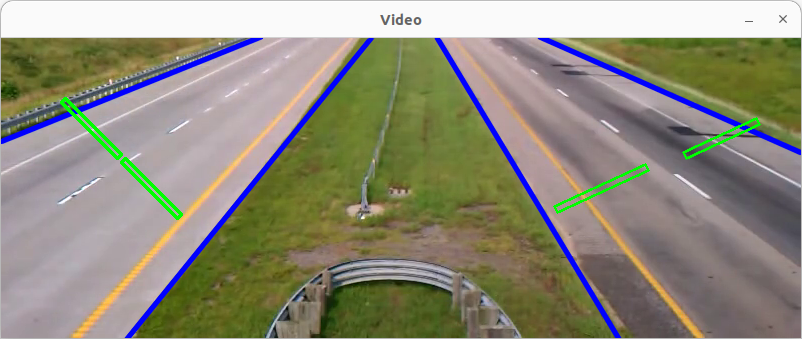
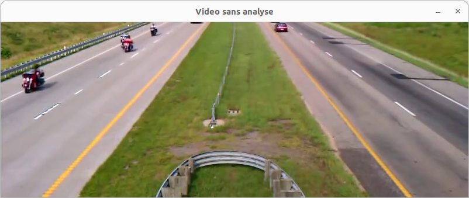

### b. Image Rotation and Extraction of Rotated Regions

The `zone` function then rotates the image, ensuring the region of interest is straight. It then extracts this region for easier analysis. Rotating the image allows for better alignment of regions of interest with vehicle trajectories.

### c. Analysis of the Rotated Region

Finally, the region of interest is analyzed. This involves counting the number of pixels corresponding to vehicles passing through this region. The vehicle count is determined based on this pixel count. Here, we faced challenges, particularly when motorcycles were close together. The analysis involved ensuring that the vehicle count was accurate and did not overestimate due to motorcycles being close together.

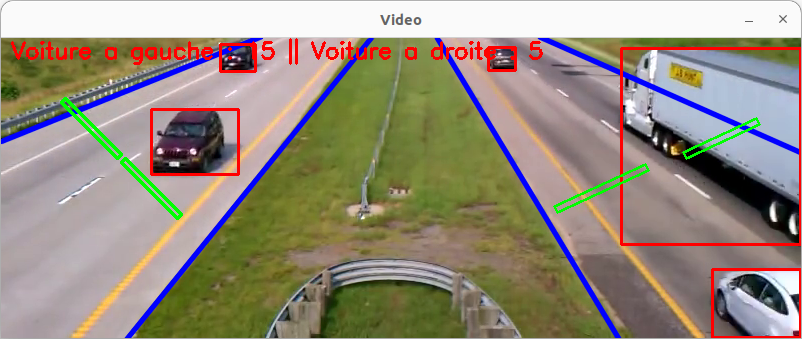

